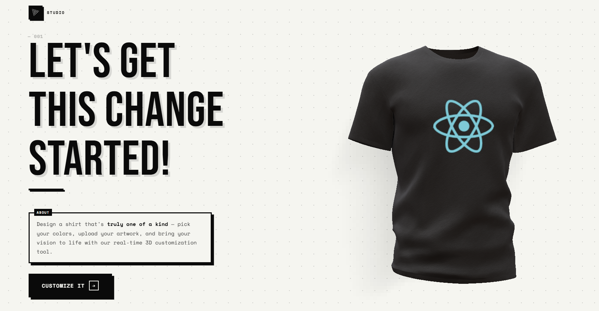

# 👕 3D T-Shirt Customizer



Welcome to the **3D T-Shirt Customizer**!

## 🚀 About The Project

This application allows users to design their own t-shirts in a fully interactive 3D environment. Whether you want to change colors, add a sleek logo, or apply a full texture, this tool makes it easy and fun. Built with the latest web technologies, it ensures a smooth and responsive experience.

### ✨ Key Features

- **3D Visualization**: View your custom t-shirt from different angles in a realistic 3D scene. 🧊
- **Color Customization**: Pick any color to match your style using the color picker. 🌈
- **Texture & Logo Upload**: Upload your own images to apply as logos or full-shirt textures. 🖼️
- **Responsive Design**: Works seamlessly on desktop and mobile devices. 📱
- **Smooth Animations**: Powered by Framer Motion for delightful transitions. 🎬

## 🛠️ Tech Stack

This project leverages a powerful stack of technologies:

- **React**: For building the user interface. ⚛️
- **Three.js**: The core 3D library. 🧊
- **React Three Fiber**: React renderer for Three.js. 🧶
- **React Three Drei**: Useful helpers for R3F. 🤝
- **Valtio**: Proxy-based state management. 🧠
- **Framer Motion**: For production-ready animations. 🎥
- **Tailwind CSS**: For rapid UI styling. 💅

## 📦 Getting Started

To get a local copy up and running, follow these simple steps:

1.  **Clone the repository**
    ```bash
    git clone https://github.com/your-username/3d-customizer.git
    ```
2.  **Install dependencies**
    ```bash
    npm install
    ```
3.  **Run the development server**
    ```bash
    npm run dev
    ```

---

Made with ❤️ by Noel
